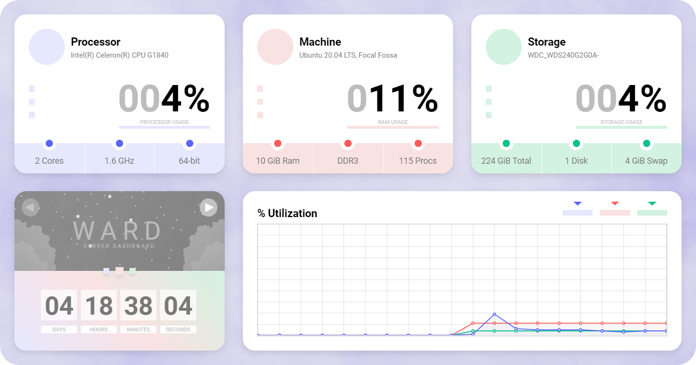
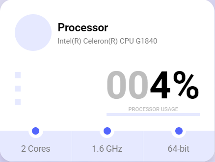
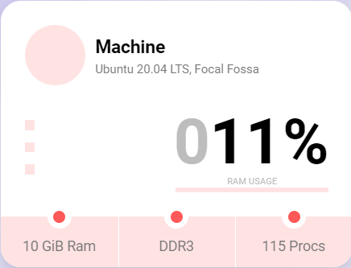
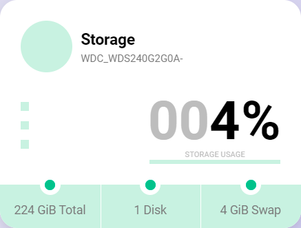
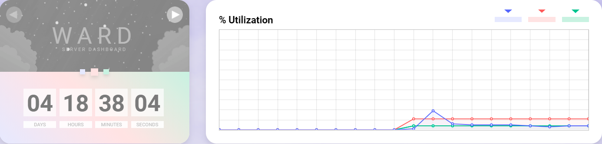

<h3 align = "center">
    
</h3>

---

### About

Ward is a simple and and minimalistic server monitoring tool. Ward supports adaptive design system. Also it supports dark theme.
It shows only principal information and can be used, if you want to see nice looking dashboard instead looking on bunch of numbers and graphs.
Ward works nice on all popular operating systems, because it uses [OSHI](https://github.com/oshi/oshi).

**All features tested on:** `Windows` `Linux`

    
    <h7 align = "center">Preview Image</h7>

---

### Features

<table>
    <tr>
        <td width = "600.5">Processor name</td>
        <td rowspan = "5">
            
        </td>
    </tr>
    <tr>
        <td>Processor utilization percentage</td>
    </tr>
    <tr>
        <td>Processor cores count (Logical and physical ones)</td>
    </tr>
    <tr>
        <td>Current frequency of the processor</td>
    </tr>
    <tr>
        <td>Does the processor supports 64-bit instructions</td>
    </tr>
</table>

 

<table>
    <tr>
        <td width = "600.5">Type of operating system and it's version</td>
        <td rowspan = "5">
            
        </td>
    </tr>
    <tr>
        <td>RAM utilization percentage</td>
    </tr>
    <tr>
        <td>Amount of total installed RAM</td>
    </tr>
    <tr>
        <td>Generation of the installed RAM (If you have dmidecode)</td>
    </tr>
    <tr>
        <td>Current processes count</td>
    </tr>
</table>

 

<table>
    <tr>
        <td width = "600.5">Host0 storage name</td>
        <td rowspan = "5">
            
        </td>
    </tr>
    <tr>
        <td>Storage utilization percentage</td>
    </tr>
    <tr>
        <td>Total current storage installed (Including external drives)</td>
    </tr>
    <tr>
        <td>Installed disks count</td>
    </tr>
    <tr>
        <td>Total amount of virtual memory (Swap in Linux)</td>
    </tr>
</table>

 

<table>
    <tr>
        <td width = "916.5">
            
        </td>
    </tr>
    <tr>
        <td>
            This block contain uptime and chart sections. Uptime represent time since last boot on Linux, and time between hard resets on Windows.
            Also it have paginator which can be useful to get author contacts.
            Chart section display last fifteen seconds of server utilization. (Proccesor, ram, storage)
            You can hide separated datasets by clicking on rectangles on the top right corner of chart section.
        </td>
    </tr>
</table>

---

### Installation
    Create your own jar

    1. Clone the project
    2. Import project in your IDE as Maven project
    3. mvn clean package
    4. jar will be in the target folder

 

    Run jar file

    1. Create you own jar as described above
    2. Execute jar on Windows or Linux with administrative rights
    3. Enter localhost:4000 and set up application

 

    Build for Docker or Pull 

    1. Clone the project
    2. git clone https://github.com/alcapone1933/Ward.git or docker pull ghcr.io/alcapone1933/ward:latest or docker pull alcapone1933/ward:latest
    3. docker build --tag ward . 
    4. docker run --rm -it --name ward -p 4000:4000 -p <application port>:<application port> --privileged ward
    5. Go to localhost:4000 in web browser, input the same application port
    6. If you get error after being redirected to application port try hitting refresh
